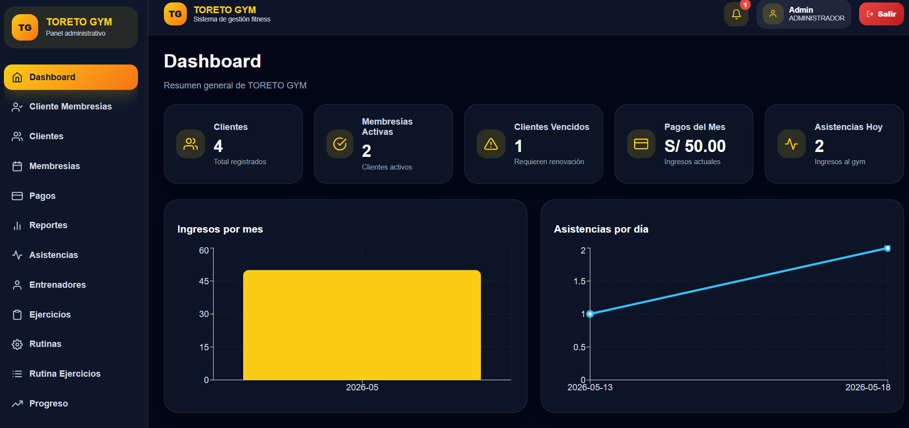
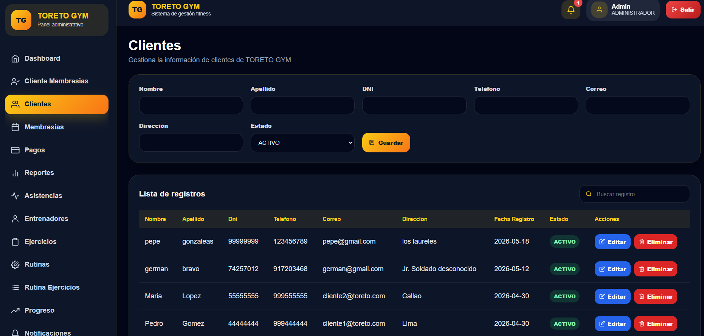
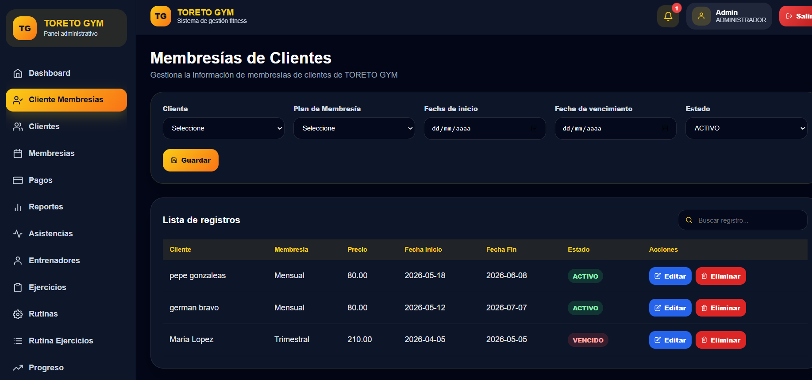
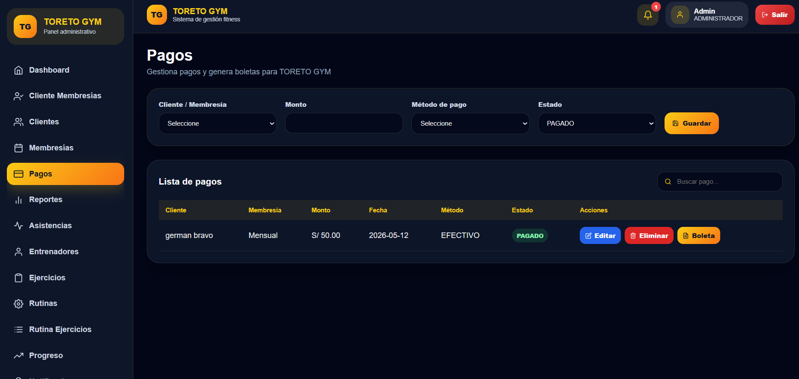
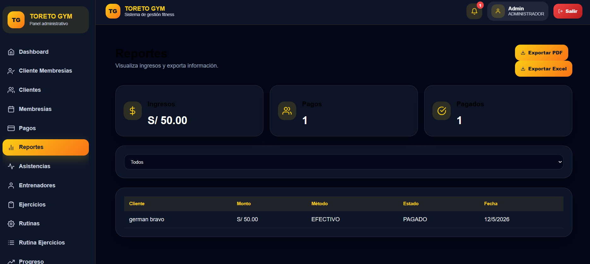
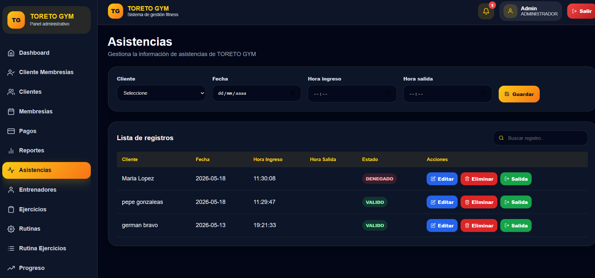
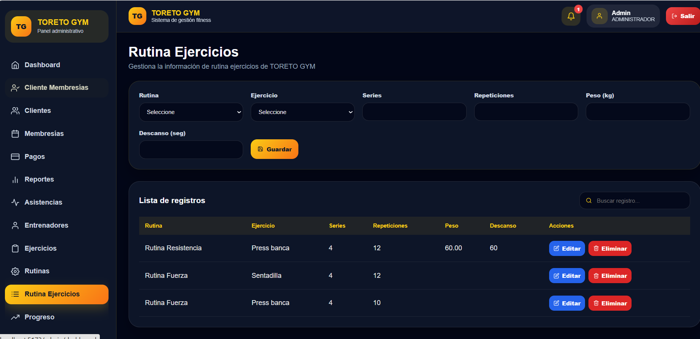

# 🏋️ TORETO GYM

Sistema de gestión completo para gimnasios desarrollado con React, Node.js, Express y MySQL.

---

# 🚀 Tecnologías utilizadas

## Frontend
- React
- Vite
- React Router DOM
- Framer Motion
- React Icons
- jsPDF
- XLSX

## Backend
- Node.js
- Express
- JWT
- bcryptjs
- dotenv

## Base de Datos
- MySQL
- phpMyAdmin
- XAMPP

---

# ✨ Funcionalidades principales

- Login con autenticación JWT
- Gestión de clientes
- Gestión de membresías
- Registro de pagos
- Control de asistencias
- Gestión de entrenadores
- Gestión de ejercicios
- Gestión de rutinas
- Rutina ejercicios
- Dashboard administrativo
- Reportes PDF y Excel
- Notificaciones automáticas
- Diseño responsive
- Interfaz moderna premium

---

# 📸 Capturas del sistema

## Dashboard


---

## Clientes


---

## Membresías


---

## Pagos


---

## Reportes


---

## Asistencias


---

## Notificaciones


---

# ⚙️ Instalación

## Backend

```bash
cd toreto_gym_backend_QA_CORREGIDO
npm install
npm run dev